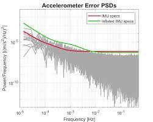

As a research staff at[ Institut für Erdmessung (IfE)](https://ife.uni-hannover.de), I am offering opportunities for **master's thesis** and **Studienarbeit**. Students of the master's program *Geodesy and Geoinformation*, as well as other programs at Leibniz University Hannover are welcome to reach out in case of interest.

Currently, the following topics are open, which, nevertheless, are not necessarily predetermined and can be adapted to your own preferences and ideas. All the topics can be taken as either a master's thesis or adapted as a Studienarbeit.

This is a highlighted quote.

Please note that I will only supervise **English-written** theses.

# Open Topics

The following topics are open:

* *High-integrity GNSS/IMU localization using interval analysis* :scroll:
* *Bounding the residual tropospheric error by interval analysis* :scroll:
* *Overbounding GNSS/IMU/Odometer integration with applications to urban navigation* :scroll:

- - -

## Topic 1: High-integrity GNSS/IMU localization using interval analysis

#### Supervisor

Prof. Steffen Schön 

#### Co-Supervisor

Jingyao Su

#### Motivation

Reliable positioning is a key issue for intelligent vehicle navigation. Rather than the classical point estimations, interval-based positioning methods have shown to be capable of computing relevant confidence domains used for integrity monitoring in environments which are challenging for Global Navigation Satellite System (GNSS). GNSS measurements with constraints from 3D-maps, road lanes as well as digital elevation models have been studied by making use of interval analysis to solve the constraint satisfaction problem based on contractions and bisections. By applying the improved observation bounding method developed at IfE, this topic will investigate the uncertainty of nonlinearity of GNSS problems.  GNSS/IMU integration will be taken into consideration for the level of master's thesis. 

#### Tasks

1. Literature review of interval-based localization methods 
2. Understand the method of interval analysis (contraction, set inversion, SIVIA, thick SIVIA)
3. Implementation of SIVIA for GNSS localization
4. Implementation of SIVIA for GNSS/IMU localization
5. Assessment and validation of the results

#### Related Works

* Drevelle, V., & Bonnifait, P. (2011). A set-membership approach for high integrity height-aided satellite positioning. *GPS solutions*, 15(4), 357-368.
* Luc Jaulin, Benoît Desrochers, Simon Rohou, Jordan Ninin, Olivier Reynet. IAMOOC: Interval analysis with applications to parameter estimation and robot localization (url: https://www.ensta-bretagne.fr/jaulin/iamooc.html)

![[Drevelle, 2011] Bird’s eye view of the trajectory. Boxes are bounding boxes of nonrobust solution sets. Reference trajectory is in black](https://media.springernature.com/lw685/springer-static/image/art%3A10.1007%2Fs10291-010-0195-3/MediaObjects/10291_2010_195_Fig7_HTML.gif)

- - -

## Topic 2: Bounding the residual tropospheric error by interval analysis

#### Supervisor

Prof. Steffen Schön 

#### Co-Supervisor

Jingyao Su

#### Motivation

GNSS integrity monitoring requires proper bounding to characterize all ranging error sources. Unlike classical approaches based on probabilistic assumptions, our alternative integrity approach depends on deterministic interval bounds as inputs. The intrinsically linear uncertainty propagation with intervals is adequate to describe remaining systematic uncertainty, the so-called imprecision. The method of interval analysis can be used to derive the required intervals in order to quantify and bound the residual error for empirical troposphere models. To this end, long-term statistics against on-site measurements should be performed to estimate the interval bounds of meteorological parameters that are needed as input to the troposphere models.

#### Tasks

1. Literature review of troposphere delay, including different empirical models and the modeling methods for the residual tropospheric error. 
2. Statistical analysis of meteorological measurements (climate data, radiosonde data). How to model their uncertainty?
3. Implementation of the interval-based sensitivity analysis for MOPS, GPT2w and ESA tropospheric model.
4. Assessment and validation of the bounding results.

#### Related Works

* Su J., Schön S. (2021): [Bounding the residual tropospheric error by interval analysis](/publication/bounding-the-residual-tropospheric-error-by-interval-analysis/), *IAG 2021 - Scientific Assembly of the International Association of Geodesy*, June 28 - July 2, 2021, Beijing, China
* Rózsa, Szabolcs, et al. "An advanced residual error model for tropospheric delay estimation." *GPS Solutions* 24.4 (2020): 1-15.
* Mendes, V. B. "Modeling the neutral-atmospheric propagation delay in radiometric space techniques." *UNB geodesy and geomatics engineering technical report* (199) 10 (1999).

- - -

## Topic 3: Overbounding GNSS/IMU/Odometer integration with applications to urban navigation

#### Supervisor

Prof. Steffen Schön 

#### Co-Supervisor

Jingyao Su

#### Motivation

The integration of GNSS with Inertial Navigation Systems (INS) has the potential to achieve high levels of continuity and availability as compared to standalone GNSS and therefore to satisfy stringent navigation requirements. The integrity of GNSS/INS integration, measuring the trustworthy of navigation solutions, is still to be investigated. This information is very important for safety-critical applications such as civil aviation and autonomous driving. GNSS-alone integrity studies have been developing an overbounding method that bounds the error in range domain, and guarantees the overbound in the position domain. This topic is to apply this method in the analysis for receiver hardware noise and extend to inertial sensors (IMU) and odometer.

#### Tasks

1. Literature review of GNSS/IMU/Odometer uncertainty modeling and bounding methods, including the CDF overbounding, as well as Autocorrelation Function (ACF)/Power Spectral Density (PSD)/Allan Variance methods. What are the advantages and disadvantages for different sensors? 
2. Implementation of overbounding agorithms in MATLAB, such as CDF, ACF, PSD, Allan Variance methods.
3. Data analysis in terms of overbounding hardware noise of different GNSS receivers
4. Data analysis in terms of overbounding uncertainty of IMU/odometer
5. Implementation of a robust extended Kalman filter with augmented state estimation

#### Related Works

* Blanch, Juan, Todd Walter, and Per Enge. "Gaussian bounds of sample distributions for integrity analysis." *IEEE Transactions on Aerospace and Electronic Systems* 55.4 (2018): 1806-1815.
* Langel, Steve, Omar García Crespillo, and Mathieu Joerger. "Overbounding the effect of uncertain Gauss-Markov noise in Kalman filtering." *NAVIGATION, Journal of the Institute of Navigation* 68.2 (2021): 259-276.
* Gallon, Elisa, Mathieu Joerger, and Boris Pervan. "Development of Stochastic IMU Error Models for INS/GNSS Integration." *Proceedings of the 34th International Technical Meeting of the Satellite Division of The Institute of Navigation (ION GNSS+ 2021)*, St. Louis, MI, USA. 2021.

