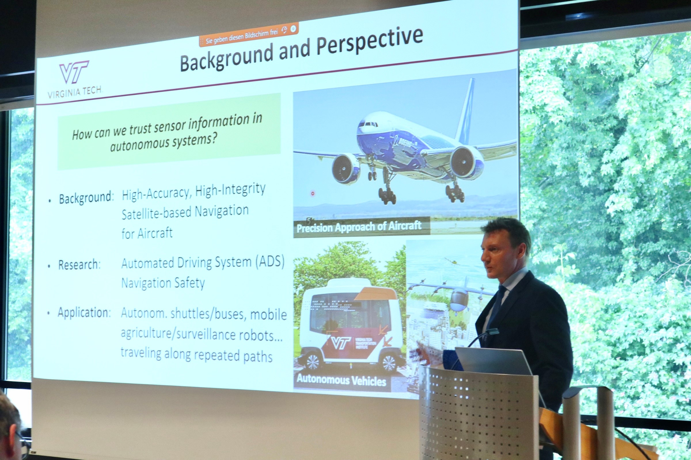
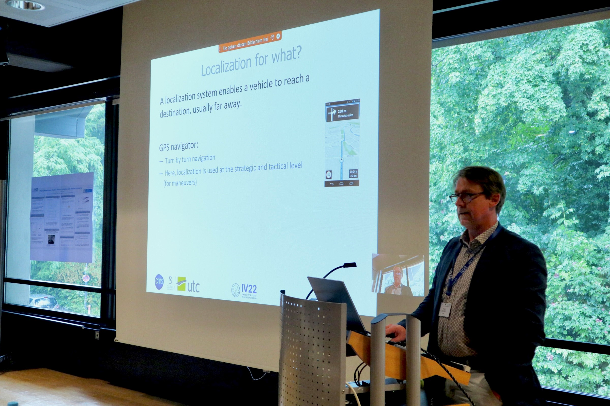
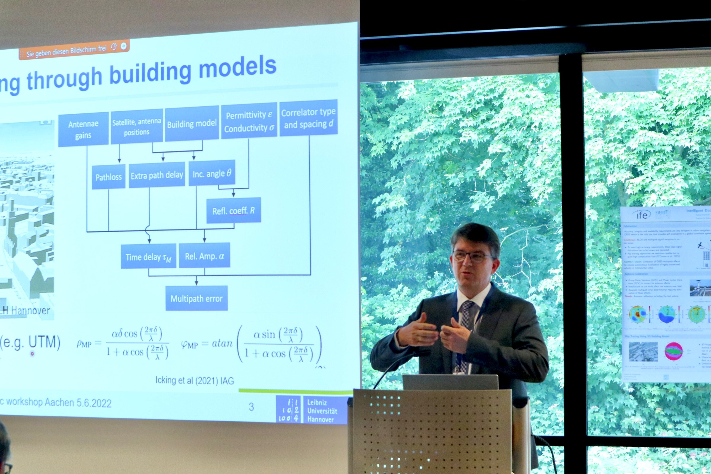
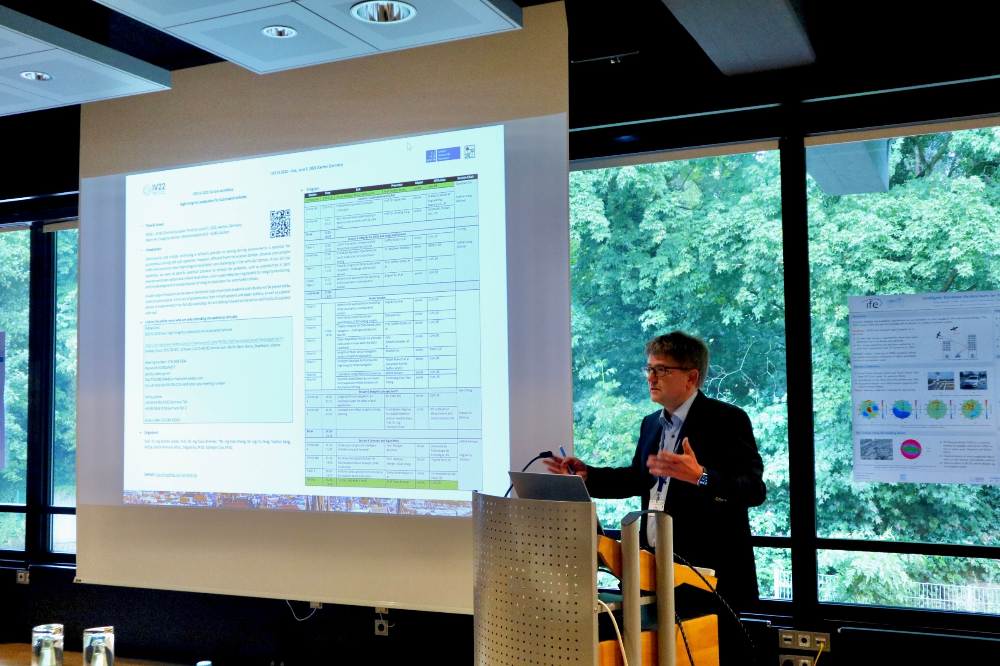
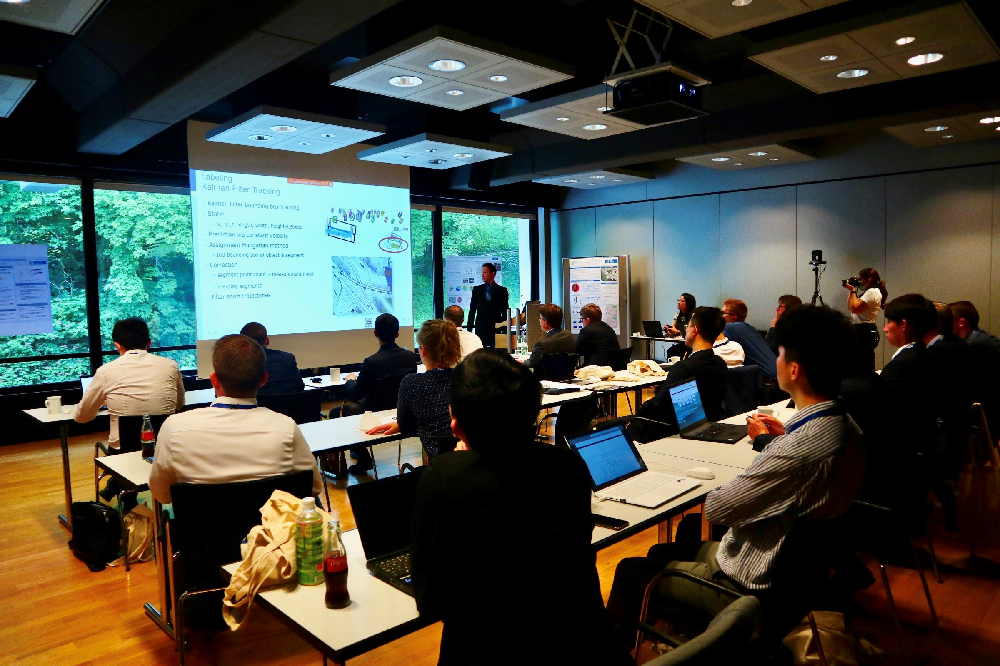

# Background

The first workshop of iLoc: High-integrity Localization for Automated Vehicles at IEEE IV 2022
On June 5, 2022, our RTG held the first workshop of iLoc: High-integrity Localization for Automated Vehicles at the 33rd IEEE Intelligent Vehicles Symposium (IV), one of the most influential international conferences for intelligent vehicles and autonomous driving in Aachen, Germany.  7 i.c.sens members took part in the organization committee and co-chaired the sessions.

Details can be found [here](https://sites.google.com/view/iloc-2022/).

I was honored to co-chair the afternoon sessions 'Integrity Concepts for IV' and 'Concepts and Algorithms', and additionally present my recent research "Deterministic approaches for bounding GNSS uncertainty: A comparative analysis" in the morning session 'Integrity for GNSS and Integrated Sensors'.

The introduction to the talk can be found [here](https://sujingyao.netlify.app/talk/talk-at-iloc-workshop-of-ieee-iv-2022/).

# Introduction and Gallery

Continuously and reliably estimating a vehicle's position in varying driving environments is essential for autonomous driving and safe operation. However, different from the aviation domain, dynamic and complex traffic environments make high-integrity localization very challenging in the vehicular domain. In the 1st iLoc workshop, we want to identify potential solutions to remedy the problems, including but not limited to: uncertainties in both environmental perception and vehicle localization, vision-based deep learning models for integrity monitoring, and the development of standardization of integrity localization for automated vehicles. 

Scientists and experts from both academia and industry gave a wide range of keynote presentations at the workshop. Our guest speakers include: 

* Prof. Mathieu Joerger, Virginia Tech USA
* Jan-Hendrik Pauls, group member of Prof. Christoph Stiller, Karlsruhe Institute of Technology (KIT) Germany
* Prof. Bisheng Yang, the State Key Laboratory of Information Engineering in SurveyingMapping and Remote Sensing (LIESMARS), Wuhan University China
* Prof. Naoki Akai, Murase Lab Nagoya University Japan
* Dr. Chen Zhu from German Aerospace Center (DLR)
* Dr. Boubeker Belabbas, BOSCH
* Prof. Philippe Bonnifait, Université de Technologie de Compiègne France

In addition, five high-quality papers addressing different aspects of integrity were presented at the workshop. The Ph.D. students from RWTH and i.c.sens were invited to present their research topics on posters and discuss them with the scientists and experts. 

Thanks to the excellent talks, high-quality papers, posters, and discussions, we had a very interactive and successful workshop. We are excited to receive plenty of supportive feedback and positive comments from Prof. Christoph Stiller, the general chair of IV, and all our participants. We look forward to meeting more researchers from the community in the coming years at our next iLoc.